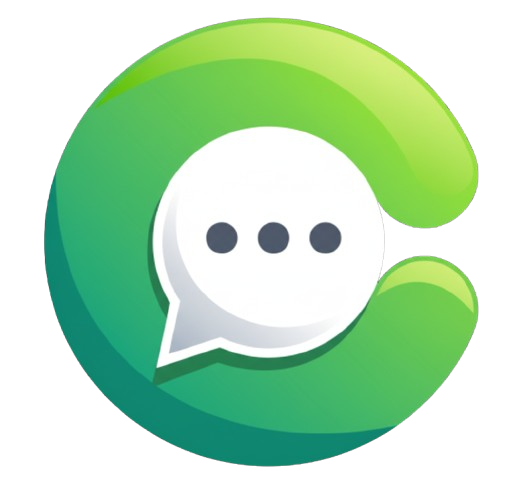

  
  
  <h1 align="center" style="font-weight: 800; font-size: 2.5rem; margin-top: 10px;">
    Chatlight
  </h1>
  
  

    <strong>A Next-Generation Real-Time Messaging & Chat Application</strong>
  

  

    
    
    
    
    
    
    
    
  

---

> **Overview**: **Chatlight** is a modern real-time chat application featuring bi-directional messaging, interactive message actions (editing, replying, pinning, deleting), Firebase Google OAuth, and React Email verification templates.

---

## Key Features

- **Instant Real-Time Messaging**: Lightning-fast message delivery using Socket.IO.
- **Dual Auth Flow**: Standard JWT Email/Password authentication & Google OAuth via Firebase.
- **React Email Verification (OTP)**: Colorful 6-digit email verification with expiration badges and Brevo SMTP delivery.
- **Message Pinning & Replies**: Pin important messages to top of chat and reply to specific messages with context reference.
- **Message Editing & Deletion**: Real-time message text editing and soft deletion synced across online users.
- **Live Presence & Read Receipts**: Real-time online/offline status indicators and message read dots.
- **Media Attachments**: High-speed image upload & modal preview powered by Cloudinary.
- **Real-Time User Search**: Instant user search with unread message badges.
- **32 DaisyUI Themes**: Full theme customizer with instant preview card.
- **Mobile Responsive Design**: Seamless layout adapted for mobile, tablet, and desktop viewports.

---

  Built with ❤️ using React, Node.js, Socket.IO

